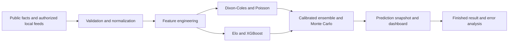
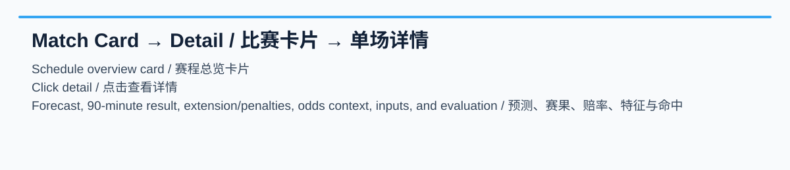

# World Cup Prediction 2026

English | [简体中文](README.zh-CN.md)

An open-source, local-first dashboard for exploring 2026 World Cup fixtures, team strength, match probabilities, knockout paths, and daily prediction reports.

The project combines Dixon-Coles and Poisson score models, Elo ratings, Monte Carlo simulation, calibrated ensembles, and optional XGBoost signals behind a FastAPI service and a dependency-free browser interface. A sanitized SQLite snapshot and precomputed API responses are included so a clean clone starts with populated match cards.

> Predictions are experimental statistical estimates. They are not betting, financial, or professional advice and do not guarantee outcomes.

## What is included

- Complete Python prediction and data-processing source code
- FastAPI API and the existing HTML/CSS/JavaScript dashboard
- Sanitized `data/worldcup.sqlite3` with CC0 history, 104 canonical final match records, project predictions, and reviewed Sporttery historical snapshots
- Sanitized prediction exports in `outputs/`
- Sanitized read-only API snapshots in `precomputed/api/`
- Tests, static export, Render configuration, and maintenance tools

Restricted raw provider payloads, credentials, and unlicensed player/roster datasets are not published. The reviewed Sporttery snapshot is a narrow field-whitelisted historical input, not a relicensed odds feed. See [DATA.md](DATA.md) for the exact boundary and update workflow.

Sporttery values are historical point-in-time snapshots used only for research, model reproduction, and prediction evaluation. They are not current odds or betting advice; see the [snapshot audit](docs/audits/sporttery-snapshot-audit-2026-07-20.md).

## Quick start

Requirements: Python 3.10 or newer and Git. SQLite CLI is useful for integrity checks but is not required by the application.

```bash
git clone https://github.com/HectorGao/worldcup-prediction2026.git
cd worldcup-prediction2026
python3 -m venv .venv
source .venv/bin/activate
python -m pip install --upgrade pip
python -m pip install -e ".[dev]"
cp .env.example .env
uvicorn worldcup_predictor.api:app --app-dir backend --host 127.0.0.1 --port 8000
```

Open <http://127.0.0.1:8000>. The checked-in public snapshot works without API keys. On macOS, `start_local_server.command` provides the same local startup flow.

## Configuration

All optional configuration is listed in `.env.example`. Keep real values only in the ignored `.env` file. Provider keys are needed only when you intentionally refresh data from a provider under your own account and terms.

Important runtime modes:

| Variable | Purpose | Default |
| --- | --- | --- |
| `WORLDCUP_DB_PATH` | SQLite database used by the service | `data/worldcup.sqlite3` |
| `WORLDCUP_USE_PRECOMPUTED` | Serve checked-in API snapshots where supported | `0` |
| `WORLDCUP_READ_ONLY` | Disable write-oriented operation for hosting | `0` |
| `WORLDCUP_PRECOMPUTED_DIR` | Precomputed snapshot root | `precomputed` |
| `SPORTTERY_ENABLE_LIVE` | Enable the optional live Sporttery path | `0` |

Never commit `.env`, tokens, passwords, private database exports, or raw provider responses.

## Test and verify

```bash
.venv/bin/pytest -q
scripts/check_repository_safety.sh
sqlite3 data/worldcup.sqlite3 'PRAGMA integrity_check;'
PYTHONPATH=backend .venv/bin/python scripts/export_static_site.py
```

The static export is written to ignored `dist/`. Repository CI runs the safety check, test suite, database integrity check, and static export on supported Python versions.

## Data refresh workflow

Raw authorized provider data belongs in ignored `.private_data/`. Generate a publishable snapshot with:

```bash
.venv/bin/python scripts/build_public_data_snapshot.py
scripts/review_daily_update.sh
```

The review script is read-only: it displays code and data changes, checks for sensitive content and large files, validates the database, runs tests, and builds the static site. It never stages, commits, or pushes changes. Review and stage individual paths yourself.

Detailed sources, data rights, private-input setup, snapshot contents, update frequency, and reproduction commands are documented in [DATA.md](DATA.md).

## Deployment

- Dynamic read-only service: use `render.yaml`; the start command is `uvicorn worldcup_predictor.api:app --app-dir backend --host 0.0.0.0 --port $PORT`.
- Static site: run `scripts/export_static_site.py` and deploy `dist/`; see [docs/static-deployment.md](docs/static-deployment.md).
- GitHub Actions: `.github/workflows/deploy-static-site.yml` can build a static artifact and deploy when the required Cloudflare secrets are configured.

No production deployment requires publishing provider credentials.

## Technical method and evaluation

The reproducible path is:



The model keeps 90-minute outcomes separate from extra-time and penalty-shootout advancement. Each persisted prediction contains the forecast timestamp, probabilities, expected goals, score matrix, model inputs, blend weights, market fields when locally authorized, and (once available) `post_match_evaluation` with Brier score and log loss. Regression artifacts in `outputs/` record accuracy, calibration, and per-match errors; they are regenerated after each reviewed result update rather than treated as immutable benchmarks.

For a fresh, auditable update, fetch all available completed scoreboard events, retain the pre-match rows, recalculate only unfinished fixtures, attach actual 90-minute/extra-time/penalty fields, run tests, and rebuild the public snapshot. The exact command is documented in [DATA.md](DATA.md).

## Final 104-match result normalization and report

The tournament evaluation population is **104 unique matches**: 72 group matches, 16 round-of-32 matches, 8 round-of-16 matches, 4 quarter-finals, 2 semi-finals, the third-place match, and the final. Raw `finished_match_results` rows remain for provenance; `canonical_match_results` is the active, alias-normalized table used by the site and reports.

Each result stores `home_score_90`, `away_score_90`, extra-time fields, penalty fields, and one shared `result_display`. For example: `France 1-1 England（加时 2-2，点球 4-3）`. Outcome and exact-score hits always use the 90-minute score.

<!-- GENERATED_FINAL_METRICS_START -->
This block is generated from the final SQLite snapshot; 90-minute scores are the evaluation basis.
- Population / evaluated / missing predictions: 104 / 104 / 2
- Outcome / exact-score hits: 70 (67.3%) / 24 (23.1%)
- Home / away / total-goal MAE and score RMSE: 0.731 / 0.654 / 1.154 / 1.052
- Brier / log loss: 0.142 / 0.723; best / hardest stage: 半决赛 / 季军赛
- Odds-covered / no-odds outcome rate: 0 (0.0%) / 104 (67.3%) (descriptive coverage split, not a causal claim).
- Timing: 1 pre-match records and 103 reconstructed post-match-or-unknown records.
<!-- GENERATED_FINAL_METRICS_END -->

These are **reconstructed-record audit metrics**, not a claim of live pre-match performance. Timing-qualified pre-match records and post-match-or-unknown records are always reported separately.


All figures and machine-readable metrics are generated from SQLite by [`tools/generate_report_assets.py`](tools/generate_report_assets.py). See [the English report](docs/assets/final_report.en.md), [the Chinese report](docs/assets/final_report.zh-CN.md), and [the metrics JSON](docs/assets/final_metrics.json).

## Match detail and evaluation labels

Clicking a match card opens its single-match detail view. It shows the saved forecast timestamp, top scoreline, win/draw/loss probabilities, expected goals, model inputs and blend, available reviewed odds context, canonical final result, and separate color-coded score/outcome labels. The API carries `prediction_evaluation` with exact-score, outcome, goal-error, timing, and 90-minute-basis fields so the browser can render accessible status labels consistently.




## Reproducing the final report

Run the canonical rebuild and attach evaluations without rerunning historical forecasts:

```bash
PYTHONPATH=backend .venv/bin/python -c "from worldcup_predictor.service import WorldCupService; s=WorldCupService('.private_data/reviewed-worldcup.sqlite3'); print(s.db.rebuild_canonical_match_results()); print(s.rebuild_prediction_evaluations())"
PYTHONPATH=backend .venv/bin/python tools/generate_report_assets.py --database .private_data/reviewed-worldcup.sqlite3 --output docs/assets
PYTHONPATH=backend .venv/bin/python -c "from pathlib import Path; from scripts.build_public_data_snapshot import build_public_database; print(build_public_database(Path('.private_data/reviewed-worldcup.sqlite3'), Path('data/worldcup.sqlite3')))"
```

The deliberate order prevents post-result model recomputation from being presented as a pre-match forecast. It preserves original prediction payloads, adds only a derived evaluation record, and never deletes raw source-result rows.

## Next tournament improvement plan

The generated case set includes an exact hit, an outcome-only hit, and a high-confidence miss (for example, a 3–0 forecast versus a 1–1 regular-time result). The draw slice is materially harder than home or away outcomes in this snapshot. These observations drive the following concrete plan.

**Data.** Start odds collection before the tournament and retain opening, intermediate, and closing timestamped prices; add injuries, suspensions, projected lineups, player/club form, travel distance, rest, timezone, and climate. Version every input and freeze a pre-match record so post-result information cannot leak into a forecast.

**Models.** Keep separate outcome classification and score-regression objectives; retain Poisson/Dixon–Coles or bivariate-Poisson baselines; compare calibrated ensembles, dynamic team ratings, draw/low-score specialists, stage-specific models, uncertainty intervals, and time-ordered validation. Run an explicit odds-feature ablation rather than treating the descriptive odds-covered split as causal evidence.

**Evaluation.** Report Log Loss, Brier score, calibration error, high-confidence hits/misses, stage, team-strength-gap, outcome, and odds-coverage slices. Publish only timestamp-qualified pre-match results as performance, and keep reconstructed diagnostics separate. Generate model/data cards and canonical case records automatically.

**Engineering.** Automate data capture and immutable snapshot archival; record model, code, and data versions per forecast; keep public and private layers separate; add database, unit, and end-to-end checks; and use GitHub Actions to validate snapshots, regenerate metrics/assets, and review rather than automatically publish unreviewed data.

## Project layout

```text
backend/worldcup_predictor/   API, database, providers, and prediction models
src/                          Browser application JavaScript and styles
data/                         Sanitized public SQLite snapshot and manifest
outputs/                      Sanitized project prediction and evaluation outputs
precomputed/api/              Sanitized read-only API snapshots
scripts/                      Export, update, safety, and maintenance tools
tests/                        Unit, API, data, frontend, and maintenance tests
```

## Contributing and security

See [CONTRIBUTING.md](CONTRIBUTING.md) before proposing changes. Please report vulnerabilities through [SECURITY.md](SECURITY.md), not a public issue. Community participation is governed by [CODE_OF_CONDUCT.md](CODE_OF_CONDUCT.md).

## Licenses

**Code license:** Project-authored source code is licensed under the [Apache License 2.0](LICENSE).

**Data license:** The Apache License does not relicense third-party data, match facts, provider responses, trademarks, images, or other third-party material. Data in this repository has source-specific rights and a deliberately sanitized release boundary described in [DATA.md](DATA.md). CC0 historical data retains its CC0 status; project-authored predictions remain separate outputs; restricted raw provider payloads are local-only.

Provider and tournament names are used for identification and attribution. No provider or tournament organizer sponsors or endorses this project.
