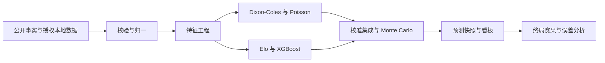
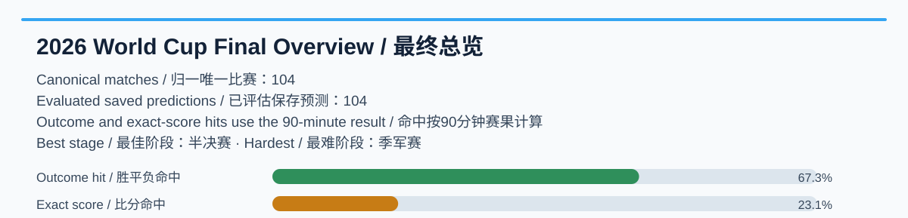
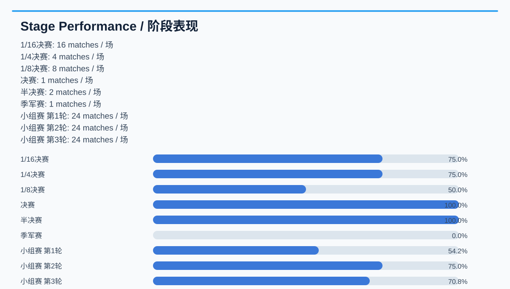
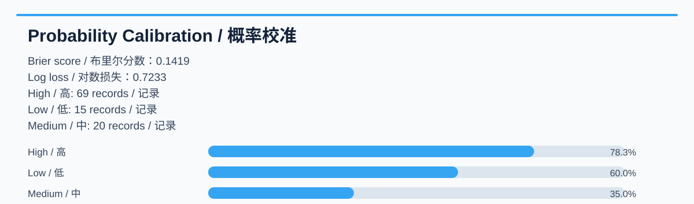
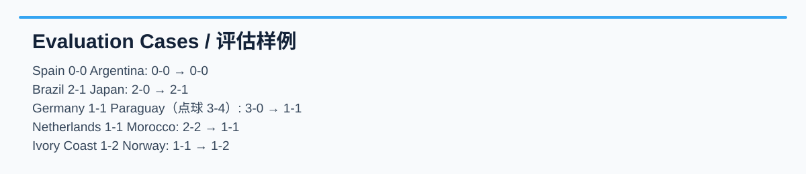

# 2026 世界杯预测

[English](README.md) | [中文](README.zh-CN.md)

开源、本地优先的 2026 世界杯数据与预测看板。它使用 FastAPI、Dixon-Coles、Poisson、Elo、Monte Carlo、校准集成与可选 XGBoost，提供赛程、球队强度、比赛概率、淘汰赛路径、赛后归因与预测报告。

> 预测仅是实验性统计估计，不构成投注、财务或专业建议，也不保证赛果。

## 包含内容

- 完整 Python 预测、数据处理、前后端源码、测试、静态导出与维护工具。
- `data/worldcup.sqlite3`：CC0 历史数据、104 场归一终局赛果、项目预测和已审查 Sporttery 历史快照。
- `outputs/` 公开预测/回归产物与 `precomputed/api/` 只读 API 快照。

不发布原始供应商载荷、凭据和未经许可的球员/阵容数据。Sporttery 快照只是经字段白名单处理的历史项目输入，并不构成赔率数据再许可。完整来源、权利边界、更新和复现方式见 [DATA.md](DATA.md)。

## 快速开始

```bash
git clone https://github.com/HectorGao/worldcup-prediction2026.git
cd worldcup-prediction2026
python3 -m venv .venv
source .venv/bin/activate
python -m pip install -e ".[dev]"
cp .env.example .env
uvicorn worldcup_predictor.api:app --app-dir backend --host 127.0.0.1 --port 8000
```

打开 <http://127.0.0.1:8000>。公开快照无需 API key；真实值只保存在被忽略的 `.env`。主要变量为 `WORLDCUP_DB_PATH`、`WORLDCUP_USE_PRECOMPUTED`、`WORLDCUP_READ_ONLY`、`WORLDCUP_PRECOMPUTED_DIR` 与 `SPORTTERY_ENABLE_LIVE`。

## 测试、部署与技术方案

```bash
.venv/bin/pytest -q
scripts/check_repository_safety.sh
sqlite3 data/worldcup.sqlite3 'PRAGMA integrity_check;'
PYTHONPATH=backend .venv/bin/python scripts/export_static_site.py
```

动态只读服务使用 `render.yaml`；静态站点运行 `scripts/export_static_site.py` 后部署 `dist/`，见 [docs/static-deployment.md](docs/static-deployment.md)。



## 104 场归一赛果与最终报告

总体为 **104 场唯一比赛**：72 场小组赛、16 场 1/16 决赛、8 场 1/8 决赛、4 场 1/4 决赛、2 场半决赛、季军赛和决赛各 1 场。`finished_match_results` 保留原始来源行；网站与报告使用经过队名别名归一的 `canonical_match_results` 活动构建。

每条归一赛果保存 `home_score_90`、`away_score_90`、加时字段、点球字段和统一 `result_display`。例如：`法国 1-1 英格兰（加时 2-2，点球 4-3）`。胜平负和比分命中均按 90 分钟赛果计算。

当前生成的审计有 104 条已匹配保存预测：胜平负命中 70 条（67.3%）、比分命中 24 条（23.1%）、比分 MAE 0.692、RMSE 1.052、Brier 0.142。这是**重建记录审计指标**，不是实时赛前表现：仅 1 条记录时间戳不晚于比赛日，另 103 条标记为赛后或时间未知。







所有图表和机器可读指标均由 [`tools/generate_report_assets.py`](tools/generate_report_assets.py) 从 SQLite 自动生成。见[中文报告](docs/assets/final_report.zh-CN.md)、[英文报告](docs/assets/final_report.en.md)和[指标 JSON](docs/assets/final_metrics.json)。

## 单场详情、复现与日常更新

点击比赛卡片进入单场详情，可查看保存的预测时间、最可能比分、胜平负概率、预期进球、模型输入/融合、可用审查后赔率上下文、归一终局赛果和命中标签。`prediction_evaluation` 提供比分命中、赛果命中、部分命中、进球误差、时间分类和 90 分钟评估口径。



```bash
PYTHONPATH=backend .venv/bin/python -c "from worldcup_predictor.service import WorldCupService; s=WorldCupService('.private_data/reviewed-worldcup.sqlite3'); print(s.db.rebuild_canonical_match_results()); print(s.rebuild_prediction_evaluations())"
PYTHONPATH=backend .venv/bin/python tools/generate_report_assets.py --database .private_data/reviewed-worldcup.sqlite3 --output docs/assets
PYTHONPATH=backend .venv/bin/python -c "from pathlib import Path; from scripts.build_public_data_snapshot import build_public_database; print(build_public_database(Path('.private_data/reviewed-worldcup.sqlite3'), Path('data/worldcup.sqlite3')))"
scripts/review_daily_update.sh
```

这套顺序不会在赛果已知后重新计算历史预测：它保留原始预测载荷，只附加派生评估，也不删除原始赛果来源行。检查后人工审阅并显式暂存，再正常提交和推送。

## 后续赛事改进计划

1. 在预测生成时保存带时区的不可变时间、特征和赔率快照。
2. 发布前检查唯一赛程 ID、90 分钟/加时/点球完整性、别名和来源权利。
3. 严格分开真正赛前指标与重建诊断；时间戳完备后再公开置信度、校准、阶段和赔率可用性切片。
4. 每个新增数据源进行权利审查，仅让有文档依据的安全字段进入公开快照。
5. 日常按“显式暂存、安全扫描、数据库完整性、测试、归一重建、报告生成、正常提交/推送”执行。

## 贡献与许可证

贡献请阅读 [CONTRIBUTING.md](CONTRIBUTING.md)，漏洞按 [SECURITY.md](SECURITY.md) 报告，社区规则见 [CODE_OF_CONDUCT.md](CODE_OF_CONDUCT.md)。

**代码许可证：**项目自有源代码采用 [Apache License 2.0](LICENSE)。

**数据许可证：**Apache-2.0 不会对第三方比赛事实、供应商响应、商标、图片或赔率重新授权。数据采用来源特定的权利边界；CC0 历史数据保持 CC0，项目预测为独立输出，受限原始载荷仅保存在本地。详见 [DATA.md](DATA.md)。
